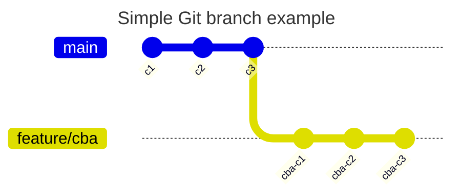
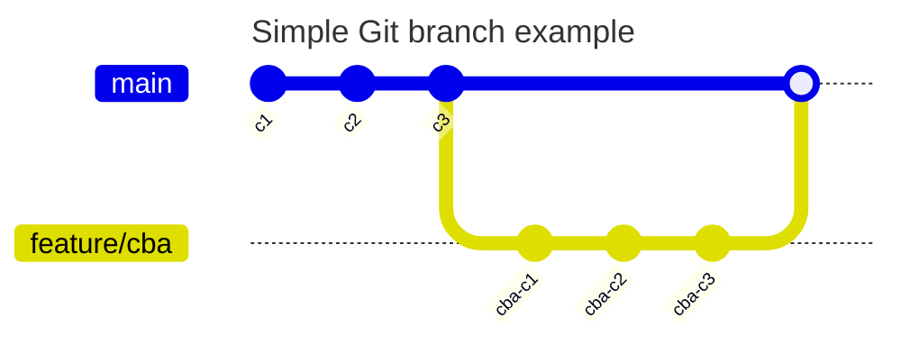
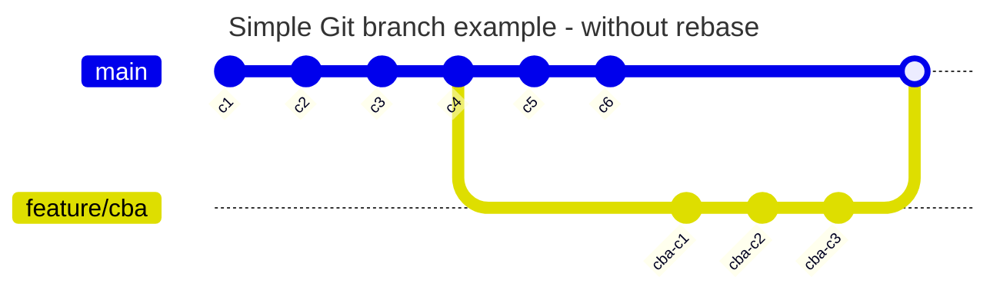
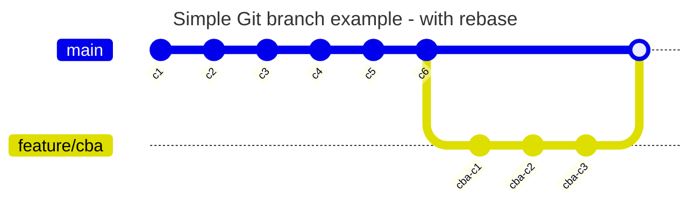
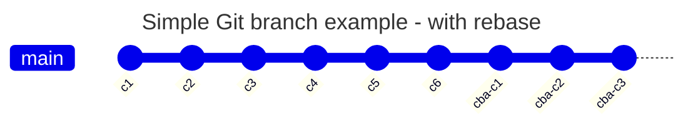

# Git Basic Concepts

This document shows some basic statements of git like a cheat sheet.

---

Table of Contents

- [Staging](#staging)
- [Commit](#commit)
- [Check status or changes](#check-status-or-changes)
- [Branches](#branches)
  - [Merging](#merging)
  - [Rebasing](#rebasing)

---

## Staging

Staging is the process of prepareing or indicating which files should be part of the next commit. A commit is a snapshot of your files.

```bash
git add file.txt # Adds file.txt to staging area.
git add .        # Adds all files of current directory to staging area.
git add -A       # Adds all files and directories to staging area.
```

Use the command `git restore`to un-stage a file.

```bash
git restore ./file1.txt
# file1.txt remains in staging area and overrides changes in working directory

git restore --staged ./file2.txt
# file2.txt is unstaged and changes in working directory are preserved
```

## Commit

To create a commit/snapshot of your files use the following:

```bash
git commit -m "Commit Message"
```

To perform an un-commit use:

```bash
git reset HEAD~1            # Unstage the last commit,
                            # keeping the changes in
                            # the working directory

git reset --hard HEAD~1     # Reset to the previous commit,
                            # discarding all changes in
                            # the working directory

git reset --soft HEAD~1     # Reset to the previous commit,
                            # keeping all changes in the
                            # staging area and working directory
```

## Check status or changes

Use `git status` to see current changes in working directory and staging area:

```bash
git status
```

To investigate commits:

```bash
git log
git log --oneline
git log --graph
git log file1.txt
```

## Branches

A branch is a pointer/reference to a commit. Thei allow you to work on new ideas without changing/touching the current, main code.

Some use cases:

- Developing a new feature
- Fixing bugs
- Security fixes
- Experimenting or prototyping
- Preparing a release
- Refactoring code
- many more

To get a list of all your branches use

```bash
git branch
git branch -l
```

To create a new branch use `git branch newBranchName`. A slash in the name is allowed so you can indicate the purpose of the branch::

```bash
git branch feature/cba
git branch bugfix/login-timeout
```

To change the branch use:

```bash
git branch --show-current
# The next statement switches the branch
git switch feature/cba
git branch --show-current
git branch
```

From now on you do not change anything in the main/master branch instead in feature/cba.



### Merging

After the last commit in branch feature/cba you can integrate the created code/commits in to the main branch:

```bash
git switch main
git merge feature/login
```

The result is:



The result is a merge commit. Check it:

```bash
git log
```

### Rebasing

In cases where the main branch gets new commits while the feature/cba branch is used (gets also commits), the rebasing of the branch would be a good idea. To rebase a branch ends in a change of the pointer to a commit:





These command must be used:

```bash
git switch feature/cba
git rebase main
git switch main
git merge feature/cba
```

`git rebase main` updates the feature/cba branch; it does not merge it into main. You still need to merge afterward.

Result:


